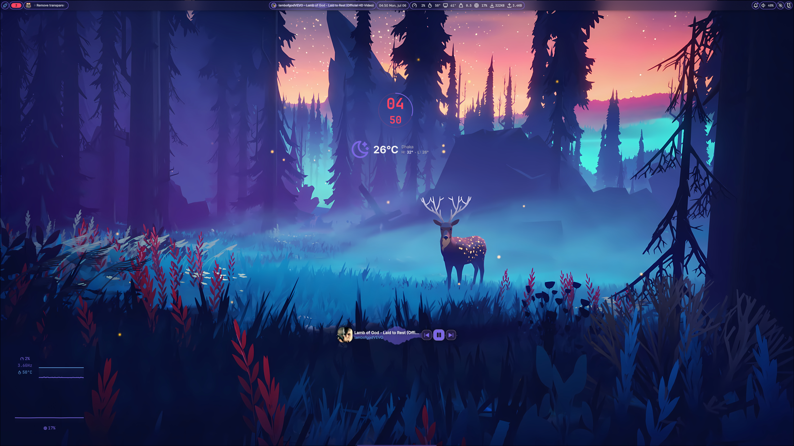
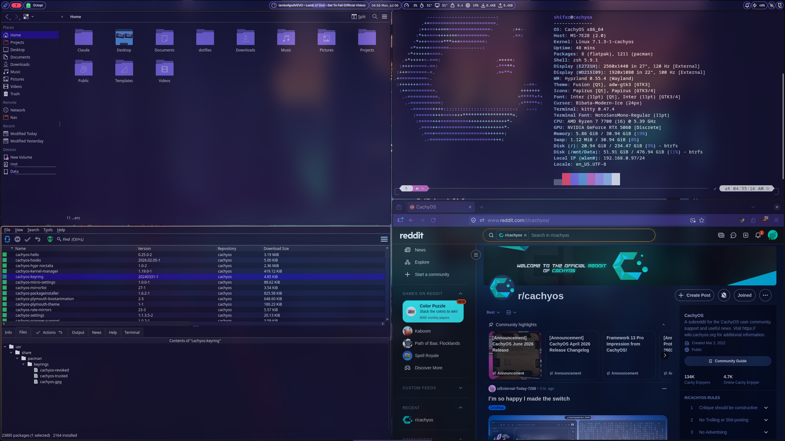

# Hyprland + Noctalia dotfiles

My daily-driver Wayland rice: [Hyprland](https://hypr.land) window manager with the
[Noctalia](https://github.com/noctalia-dev/noctalia-shell) desktop shell, based on the
CachyOS Noctalia edition's **Lua-native** Hyprland config.

> **Note:** this setup uses Hyprland's Lua config (`hyprland.lua` + `config/*.lua`).
> A plain `hyprland.conf` is ignored — edit the `.lua` files.

## Screenshots




## What's inside

```
config/
├── hypr/           Hyprland: keybinds, window rules, decorations, animations…
└── noctalia/       Noctalia shell: bar, launcher, lock screen, plugins, colors
```

Highlights:

- Global window translucency + blur, with opaque-browser exception (window rule)
- Floating bar, region screenshots piped into swappy (`Super+Shift+S`)
- Clipboard history, emoji picker, scratchpad workspace
- Noctalia plugins: arch-updater, polkit-agent, screen-toolkit

## Requirements

- Hyprland with Lua config support (CachyOS ships this; the config came from the
  `cachyos-hypr-noctalia` package)
- [noctalia-shell](https://github.com/noctalia-dev/noctalia-shell) (Quickshell-based)
- `uwsm` (session manager — or blank out `launchPrefix` in `config/hypr/config/keybinds.lua`)
- For screenshots: `grim`, `slurp`, `swappy`
- For clipboard history: `wl-clipboard`, `cliphist`

## Install

```sh
git clone https://github.com/shifaz-dev/dotfiles.git
cd dotfiles
./install.sh
```

`install.sh` backs up your existing `~/.config/hypr` and `~/.config/noctalia`
(as `*.bak-<timestamp>`) before copying anything.

After logging back in, open Noctalia settings (`Super+Z`) and set your own
weather city, avatar, and wallpaper directory — those are placeholders here.

## Keybinds (the ones that matter)

| Keys | Action |
|---|---|
| `Super+Space` | App launcher |
| `Super+Return` | Terminal |
| `Super+Q` | Close window |
| `Super+F` / `Super+D` | Fullscreen / maximize |
| `Super+1…0` | Switch workspace |
| `Super+Shift+1…0` | Move window to workspace |
| `Super+V` | Clipboard history |
| `Super+Shift+S` | Region screenshot → annotate |
| `Super+X` / `Super+Z` | Control center / settings |
| `Super+L` | Lock screen |
| `Super+S` | Scratchpad |

Full list: `config/hypr/config/keybinds.lua`.

## Credits

- [Noctalia](https://github.com/noctalia-dev/noctalia-shell) by noctalia-dev
- Base config from [CachyOS](https://cachyos.org)'s Hyprland/Noctalia edition
